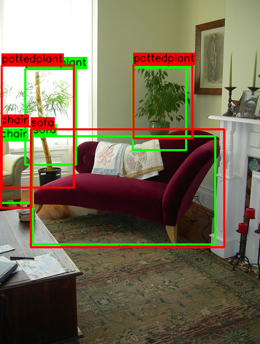

# SSD: Single Shot MultiBox Detector

## # Difference from Paper
1. VGG16 -> ResNetv2-50
2. Smooth L1 Loss -> GIoU
3. Online Hard Nagative Mining -> Focal Loss
4. Input Resolution 300x300 -> 321x321

## # Results (Pascal VOC 2007 Test)
| Model  | mAP |
| ------------- | ------------- |
| (paper) YOLOv1-VGG16 | 66.4% |
| (paper) SSD300-VGG16 | 74.3% |
| (self) YOLOv1+ | 78.47% |
| (self) SSD321-ResNetv2-50 | 78.65% |

## # Test Samples (Green - Prediction, Red - Ground Truth)

## # Tensorboard

## # Reference
- SSD: Single Shot MultiBox Detector [[Paper]](https://arxiv.org/abs/1512.02325)
- You Only Look Once: Unified, Real-Time Object Detection [[Paper]](https://arxiv.org/abs/1506.02640) [[Code]](https://github.com/OFRIN/Tensorflow_YOLOv1)
- Focal Loss for Dense Object Detection [[Paper]](https://arxiv.org/abs/1708.02002)
- Generalized Intersection over Union: A Metric and A Loss for Bounding Box Regression [[Paper]](http://openaccess.thecvf.com/content_CVPR_2019/papers/Rezatofighi_Generalized_Intersection_Over_Union_A_Metric_and_a_Loss_for_CVPR_2019_paper.pdf) [[Code]](https://github.com/OFRIN/Tensorflow_GIoU)
